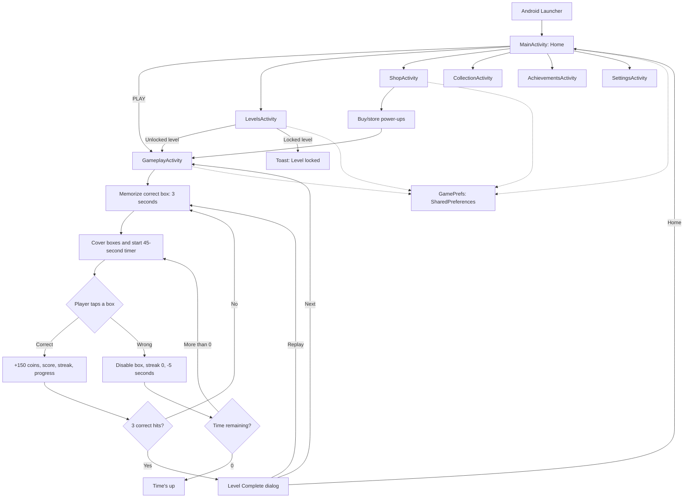

# Box Selector

## 1. Pangkalahatang Ideya

Ang **Box Selector** ay isang Android memory game. Sa bawat round, ipinapakita muna kung aling box ang tamang piliin. Pagkatapos itong takpan, kailangang tandaan ng player ang lokasyon at piliin ito mula sa 3x3 na grid.

Ang app ay may levels, coins, score, streak, timer, power-ups, shop, collection, achievements, at settings screens. Ang kasalukuyang implementation ay isang local/offline Android app. Wala itong nakikitang server, database, login, o online service.

## 2. Paano Gumagana ang App

1. Binubuksan ng app ang `MainActivity`, ang home screen.
2. Kapag pinili ang **PLAY**, binubuksan ang kasalukuyang highest unlocked level.
3. Sa `GameplayActivity`, random na pumipili ang app ng isa sa 9 boxes.
4. Ipinapakita ang tamang box sa loob ng 3 segundo. Hindi pa puwedeng mag-tap habang nasa memorization phase.
5. Tinatakpan ang boxes at nagsisimula ang 45-second timer.
6. Kapag tama ang napili, nadaragdagan ang score, streak, progress, at coins.
7. Kapag mali, nagiging disabled ang napiling box at nababawasan ng 5 segundo ang timer.
8. Pag naka-3 tamang hit, panalo ang level at naa-unlock ang susunod na level.
9. Kapag naubos ang oras, tapos ang game at madi-disable ang game controls.

## 3. Main Features

- **Home screen:** May PLAY button, coins display, at shortcuts papunta sa Levels, Shop, Collection, Achievements, at Settings.
- **Memory game:** 3x3 grid ng boxes na may random na tamang box sa bawat round.
- **Timer:** May 45 segundo bawat level; puwedeng bawasan ng maling tap o dagdagan gamit ang Extra Time.
- **Score at streak:** May score counter at sunod-sunod na tamang sagot counter.
- **Coins:** Nagsisimula sa 200 coins at kumikita ng 150 coins bawat tamang box.
- **Levels:** May 9 level buttons sa UI. Naka-unlock ang unang level sa bagong install; nagbubukas ang kasunod kapag natapos ang level.
- **Shop:** Bumibili ng Hint, Extra Time, at Box Reveal gamit ang coins.
- **Level complete dialog:** May stars, coins earned, Home, Replay, at Next buttons.
- **Collection:** Nagpapakita ng rewards, badges, at special items na may locked/unlocked visual state.
- **Achievements:** Nagpapakita ng achievement descriptions tulad ng First Box, Hot Streak, at Shopper.
- **Settings:** May Sound at Music switches na nagpapakita ng on/off Toast message.

## 4. Game Rules

### Round at level rules

- May **9 boxes** sa bawat round.
- Random ang tamang box gamit ang `Random.nextInt(9)`.
- May **3 segundo** para makita at maalala ang tamang box.
- May **45 segundo** na starting time para sa gameplay.
- Kailangan ng **3 correct hits** para matapos ang level.
- Pagkatapos ng correct hit, may 800 ms delay bago magsimula ang susunod na memorization round.
- Nagre-reset ang score, streak, progress, at level timer kapag nag-Replay ng level.

### Correct at wrong selection

- **Correct:**
  - +150 coins.
  - Score increase na `10 + (streak * 2)` pagkatapos dagdagan ang streak.
  - Nadadagdagan ng 1 ang correct hits.
  - Nadadagdagan ng 1 ang streak.
  - Nagiging 100% ang progress kapag umabot sa 3 hits.
- **Wrong:**
  - Nagiging wrong-looking at disabled ang napiling box.
  - Nire-reset ang streak sa 0.
  - Bumabawas ng 5 segundo sa timer.
  - Kung umabot sa zero ang natitirang oras, timeout ang game.

### Stars sa level complete

- Palaging napupuno ang unang star kapag natapos ang level.
- Napupuno ang pangalawang star kung may hindi bababa sa 15 segundo na natitira.
- Napupuno ang pangatlong star kung may hindi bababa sa 30 segundo na natitira.

### Power-ups

| Power-up | Presyo kung coins ang gagamitin | Epekto |
|---|---:|---|
| Hint | 50 coins | Hinahighlight ang tamang box. Kung may stored Hint, iyon muna ang ginagamit. |
| Extra Time | 100 coins | Nagdadagdag ng 20 segundo. Kung may stored item, iyon muna ang ginagamit. |
| Box Reveal | 150 coins | Nagpapakita ng hanggang 3 maling boxes at dini-disable ang mga ito. |

Magagamit lamang ang power-ups habang nasa active tap phase. Hindi sila puwedeng gamitin sa memorization phase, pagkatapos ng timeout, o pagkatapos manalo.

## 5. Project Structure

Ang sumusunod na tree ay para lamang sa source/configuration files na mahalaga sa project. Hindi isinama ang generated o temporary folders gaya ng `build/`, `.gradle/`, `.idea/`, at `local.properties`.

```text
Box Selector Mobile App/
├── build.gradle
├── gradle.properties
├── settings.gradle
├── gradle/
│   └── wrapper/
│       └── gradle-wrapper.properties
├── app/
│   ├── build.gradle
│   ├── proguard-rules.pro
│   └── src/
│       └── main/
│           ├── AndroidManifest.xml
│           ├── java/com/boxselector/app/
│           │   ├── MainActivity.java
│           │   ├── GameplayActivity.java
│           │   ├── LevelsActivity.java
│           │   ├── ShopActivity.java
│           │   ├── CollectionActivity.java
│           │   ├── AchievementsActivity.java
│           │   ├── SettingsActivity.java
│           │   └── GamePrefs.java
│           └── res/
│               ├── drawable/
│               ├── layout/
│               └── values/
│                   ├── colors.xml
│                   ├── strings.xml
│                   └── themes.xml
└── DOCUMENTATION.md
```

## 6. Paliwanag ng Root Files

- **`settings.gradle`** - Pangalan ng project, repositories, at pag-register ng `:app` module.
- **`build.gradle`** - Root Gradle configuration. Dito naka-register ang Android Application Gradle Plugin version `8.7.2`.
- **`gradle.properties`** - Gradle memory setting, UTF-8 encoding, AndroidX setting, at non-transitive R class setting.
- **`gradle/wrapper/gradle-wrapper.properties`** - Tinutukoy ang Gradle Wrapper distribution na `gradle-8.11.1-all.zip`.
- **`app/build.gradle`** - Android module configuration, SDK versions, package/application ID, version, Java compatibility, at dependencies.
- **`app/proguard-rules.pro`** - Lugar para sa project-specific ProGuard/R8 rules. Wala pang custom rule sa kasalukuyan.
- **`DOCUMENTATION.md`** - Documentation na ito.

Ang `local.properties` ay local machine configuration at sadyang hindi isinama sa pagsusuring dokumentasyon dahil naglalaman ito ng local Android SDK path.

## 7. Paliwanag ng Java Files

### `MainActivity.java`

Home screen ng app. Ikinokonekta nito ang buttons sa layouts at nagbubukas ng ibang screens gamit ang `Intent`:

- `PLAY` - Binubuksan ang `GameplayActivity` at ipinapasa ang highest unlocked level.
- `Levels` - Binubuksan ang level selection.
- `Shop` - Binubuksan ang shop.
- `Collection` - Binubuksan ang collection.
- `Achievements` - Binubuksan ang achievements.
- Settings icon - Binubuksan ang settings.
- `onResume()` - Ina-update ang coins display tuwing bumabalik sa home screen.

### `GameplayActivity.java`

Ito ang pangunahing game logic.

- `onCreate()` - Binabasa ang level mula sa Intent, kinokonekta ang views, inilalagay ang listeners, at sinisimulan ang level.
- `connectViews()` - Hinahanap ang text views, progress bar, power-up buttons, at 9 box buttons mula sa XML.
- `setupClickListeners()` - Naglalagay ng click behavior sa boxes at power-ups.
- `startLevel()` - Nire-reset ang level state at sinisimulan ang memorization phase.
- `startMemorizeRound()` - Random na pumipili ng correct box, ipinapakita ito, at dini-disable ang taps.
- `startMemorizeCountdown()` - Nagpapatakbo ng 3-second countdown gamit ang `CountDownTimer`.
- `coverBoxesAndStartPlay()` - Tinatanggal ang highlight, ine-enable ang grid, at sinisimulan ang gameplay timer.
- `startTimer()` - Nagpapatakbo o nagre-restart ng countdown gamit ang natitirang milliseconds.
- `onBoxClicked()` - Nagpapasya kung correct o wrong ang napiling box.
- `handleCorrectBox()` - Nag-a-update ng hits, streak, score, coins, at progress.
- `handleWrongBox()` - Nagdi-disable ng maling box at nagbabawas ng 5 segundo.
- `winLevel()` - Nagse-save ng next unlocked level at nagpapakita ng completion dialog.
- `endGameByTimeout()` - Tinatapos ang game kapag zero na ang oras.
- `useHint()` / `highlightCorrectBox()` - Gumagamit o bumibili ng Hint at hina-highlight ang tama.
- `useExtraTime()` - Gumagamit o bumibili ng Extra Time at nagdadagdag ng 20 segundo.
- `useBoxReveal()` - Gumagamit o bumibili ng Box Reveal at nagdi-disable ng hanggang 3 maling boxes.
- `showLevelCompleteDialog()` - Gumagawa ng dialog para sa stars, coins, replay, home, at next actions.
- `updateProgress()` - Kinakalkula ang progress mula sa correct hits at target na 3.
- `formatTime()` - Ginagawang `0:45` na format ang milliseconds.
- `onDestroy()` - Kinakansela ang timers at delayed callbacks kapag nagsara ang screen.

### `GamePrefs.java`

Central helper para sa local save data. Gumagamit ito ng Android `SharedPreferences` file na `box_selector_prefs`.

- Coins: `getCoins()`, `setCoins()`, `addCoins()`, `spendCoins()`.
- Hint inventory: `getHints()`, `addHint()`, `useHint()`.
- Extra Time inventory: `getExtraTime()`, `addExtraTime()`, `useExtraTime()`.
- Box Reveal inventory: `getBoxReveal()`, `addBoxReveal()`, `useBoxReveal()`.
- Level progress: `getHighestLevel()` at `unlockLevel()`.

### `LevelsActivity.java`

Nagpapakita ng 9 level buttons. Kinukuha ang highest level sa `GamePrefs`; ang unlocked levels ay puwedeng buksan at ang locked levels ay nagpapakita ng `Level locked!` Toast.

### `ShopActivity.java`

Nagpapakita ng coin balance at tatlong items. Ang `buyItem()` ay nagbabawas ng coins at nagdadagdag ng katumbas na power-up inventory kapag sapat ang coins.

### `CollectionActivity.java`

Nagpapakita ng rewards, badges, at special items. Ang back button lang ang may logic; ang collection items ay static UI at hindi ina-update ng Java code.

### `AchievementsActivity.java`

Nagpapakita ng tatlong achievement cards: First Box, Hot Streak, at Shopper. Ang back button lang ang may action; wala pang code na nagta-track o nagse-save ng achievement completion.

### `SettingsActivity.java`

May back button at Sound/Music switches. Ang switches ay nagpapakita lamang ng Toast na `Sound on/off` o `Music on/off`; hindi sine-save ang setting at walang aktuwal na audio controller sa kasalukuyang code.

## 8. Paliwanag ng XML Layout Files

- **`activity_main.xml`** - Home UI: top bar na may coins at settings, title/icon, PLAY button, at bottom menu buttons.
- **`activity_gameplay.xml`** - Game UI: level, coins, timer, status/countdown, progress bar, 3x3 box grid, score, streak, at tatlong power-up buttons.
- **`activity_levels.xml`** - 3-column grid ng Levels 1 hanggang 9 at paliwanag ng green/locked state.
- **`activity_shop.xml`** - Shop header, coin balance, at cards para sa Hint, Extra Time, at Box Reveal.
- **`activity_collection.xml`** - Scrollable list/sections para sa Rewards, Badges, at Special Items.
- **`activity_achievements.xml`** - Achievement cards para sa First Box, Hot Streak, at Shopper.
- **`activity_settings.xml`** - Sound switch, Music switch, at project information text.
- **`dialog_level_complete.xml`** - Completion dialog na may stars, coins earned, Home, Replay, at Next buttons.

Ang screen layouts ay gumagamit ng standard Android views tulad ng `LinearLayout`, `RelativeLayout`, `GridLayout`, `ScrollView`, `Button`, `TextView`, `ImageView`, `ImageButton`, `ProgressBar`, at `Switch`.

## 9. Paliwanag ng Resource Files

### `values/`

- **`strings.xml`** - App name, screen labels, game messages, power-up names, at dialog labels.
- **`colors.xml`** - Main palette: deep blue background, yellow accent, green buttons, text colors, locked gray, at wrong-box red.
- **`themes.xml`** - `Theme.BoxSelector`, na gumagamit ng Material Components DayNight theme na walang action bar. Itinatakda rin ang primary/secondary colors at status/navigation bar colors.

### `drawable/`

Ang drawable files ay XML vector icons at shape/background resources para sa visual design ng app.

- **Backgrounds at shapes:** `bg_top_bar`, `bg_card`, `bg_card_yellow`, `bg_dialog`, `bg_button_green`, `bg_button_white`, `bg_button_yellow`, `bg_circle_white`, `bg_icon_circle`, `bg_progress`.
- **Box states:** `bg_box`, `bg_box_correct`, `bg_box_wrong`, `bg_box_hint`.
- **Item states:** `bg_item_locked`, `bg_item_unlocked`.
- **Navigation/action icons:** `ic_home`, `ic_back`, `ic_play`, `ic_next`, `ic_replay`, `ic_settings`, `ic_cart`.
- **Game/status icons:** `ic_box`, `ic_box_small`, `ic_coin`, `ic_score`, `ic_time`, `ic_flame`, `ic_hint`, `ic_reveal`.
- **Menu/collection icons:** `ic_levels`, `ic_shop`, `ic_collection`, `ic_trophy`, `ic_badge`, `ic_gem`, `ic_gift`, `ic_key`, `ic_clover`, `ic_lock`.
- **Stars at launcher:** `ic_star`, `ic_star_empty`, at `ic_launcher`.

## 10. Android Manifest

Ang `AndroidManifest.xml` ay nagde-declare ng application label, launcher icon, theme, backup support, RTL support, at portrait orientation.

- `MainActivity` ang launcher activity dahil mayroon itong `MAIN` action at `LAUNCHER` category.
- `MainActivity` lamang ang `exported="true"` dahil ito ang entry point na puwedeng tawagin ng Android launcher.
- Ang `GameplayActivity`, `ShopActivity`, `CollectionActivity`, `LevelsActivity`, `AchievementsActivity`, at `SettingsActivity` ay `exported="false"`, kaya internal navigation lamang ang gamit.
- Lahat ng declared activities ay naka-lock sa portrait orientation.
- Walang permissions, internet requirement, service, receiver, provider, o deep link na naka-declare.

## 11. Daloy ng App



## 12. Paano Patakbuhin ang Project

### Mga kailangan

- Android Studio na compatible sa Android Gradle Plugin `8.7.2`.
- Gradle Wrapper na gumagamit ng Gradle `8.11.1`.
- Android SDK na may compile/target SDK 34.
- Java 8-compatible configuration, ayon sa `compileOptions`.
- Android device o emulator na hindi bababa sa API 24.

### Sa Android Studio

1. Buksan ang project folder na `Box Selector Mobile App`.
2. Hintaying matapos ang Gradle sync.
3. Pumili ng Android emulator o nakakonektang device.
4. Patakbuhin ang `app` configuration gamit ang **Run**.
5. Magbubukas ang app sa `MainActivity`.

### Gamit ang terminal

Sa project root, maaaring gamitin ang Gradle Wrapper:

```bash
./gradlew assembleDebug
```

Ang debug APK ay karaniwang mapupunta sa:

```text
app/build/outputs/apk/debug/app-debug.apk
```

Para mag-install sa nakakonektang device na may ADB:

```bash
./gradlew installDebug
```

Ang `local.properties` ay kailangang ma-configure sa lokal na machine upang malaman ng Gradle kung nasaan ang Android SDK. Hindi dapat i-commit ang file na ito.

## 13. Mga Ginagamit na Library

Mula sa `app/build.gradle`, ang project ay gumagamit ng:

- **AndroidX AppCompat `1.6.1`** - Base support para sa `AppCompatActivity` at compatible Android behavior.
- **Google Material Components `1.11.0`** - Material-based Android UI components at theme support.
- **AndroidX ConstraintLayout `2.1.4`** - Constraint layout library. Wala itong direktang paggamit sa mga layout na kasalukuyang nakita, pero kasama ito bilang dependency.
- **Android Gradle Plugin `8.7.2`** - Build plugin para sa Android application module.

Gumagamit din ang app ng Android SDK classes tulad ng `CountDownTimer`, `Handler`, `SharedPreferences`, `Dialog`, `Intent`, at standard widgets.

## 14. Mahahalagang Paalala sa Pag-edit

- Panatilihin ang package name na `com.boxselector.app` maliban kung babaguhin din ang namespace, manifest, at Java package declarations.
- Kapag nagdagdag o nagpalit ng view sa XML, tiyaking tugma ang ID sa `findViewById()` sa Java file.
- Ang game constants tulad ng timer, penalty, coins, at target hits ay nasa simula ng `GameplayActivity.java`.
- Ang saved keys at default values ay nasa `GamePrefs.java`. Kapag binago ang key name, maaaring mawala sa app ang dating locally saved data.
- Ang coins at power-up inventories ay local lamang sa device at walang cloud backup logic.
- Kapag nagdagdag ng level sa UI, kailangan ding suriin ang `LevelsActivity` button IDs at ang intended level progression.
- Ang Collection at Achievements ay kasalukuyang static display. Kailangan ng dagdag na state/data logic bago sila maging tunay na interactive.
- Ang Sound at Music switches ay visual/Toast behavior lamang; wala pang persistent settings o audio playback logic.
- Gumamit ng `strings.xml` para sa bagong user-facing text sa halip na hardcoded strings sa Java o layout.
- Huwag mag-edit o mag-commit ng generated folders tulad ng `build/`, `.gradle/`, at `.idea/`.
- Huwag isama sa version control ang `local.properties` dahil machine-specific ang Android SDK path nito.

## 15. Buod

Ang Box Selector ay isang offline Android memory game na may 3x3 box selection, timed rounds, coins, score, streak, levels, at shop power-ups. Ang pangunahing game behavior ay nasa `GameplayActivity`, habang ang local progress at inventory ay pinamamahalaan ng `GamePrefs` gamit ang `SharedPreferences`.

Ang project ay isang single `app` module na gumagamit ng Java at XML layouts. Kumpleto ang pangunahing playable flow mula Home papunta sa Gameplay at level completion. Ang Collection, Achievements, at Settings screens ay mayroon nang UI, ngunit ang kanilang interactive data behavior ay limitado pa sa kasalukuyang source code.
